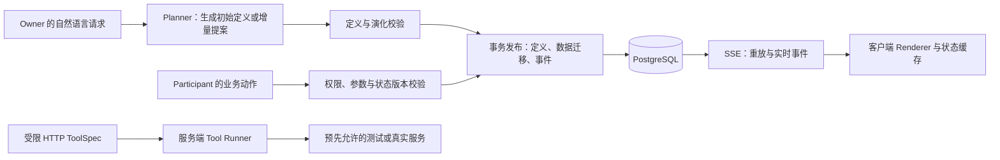

# LivingForma — 后端架构与接口提案

状态：待评审设计；尚未实现 · 2026-10-03 · America/Vancouver

依据：[产品需求](PRD.md)。产品优先让用户创建不同类别的轻量 App，并在已有数据后持续修改它；活动、签到和投票只是可选示例。本文件定义后端实现候选与前后端契约，不表示用户已锁定技术栈，也不表示接口、数据库或服务已经存在。

## 1. 拟议运行方式

候选后端为 Node.js / TypeScript + Fastify；持久层为 PostgreSQL，用户当前优先考虑 Tiger Data。先由 DevOps 核实 Shared Free 条件和连接，再由 Backend 验证迁移与持久化；没有证据时不视为服务已创建。其他 PostgreSQL 托管仅为后备评估，业务数据保留单一事实来源。候选实时方案为 SSE，客户端写操作通过普通 HTTP；若部署条件不支持长连接，再评估其他传输方案。

用户已确定 Google OAuth 登录及 livingforma.tech 部署目标。DevOps 拥有 `packages/auth/` 中 provider、回调校验和 session/退出模块；Backend 在 `apps/api/src/` 挂载模块，在 `packages/db/` 维护 Google subject 到内部用户的映射及空间成员授权；Frontend 仅消费 session 状态并提供登录控件。身份已确定，具体认证库和接口仍待 LF-100 定稿。参见 [角色归属](ROLE-OWNERSHIP.md) 和 [Google 登录](operations/google-oauth.md)。



Planner 不能直接修改数据库、安装包或运行生成的代码。它只能返回声明式提案；后端依照已实现的字段、组件、动作和 HTTP 能力目录执行。超出目录的需求返回产品可理解的限制。

## 2. State、AppSpec 与 ToolSpec 分工

| 层 | 内容 | 所有权与演化规则 |
| --- | --- | --- |
| State | 业务实体 schema、业务记录、记录版本与空间状态版本 | schema 决定记录合法性；字段值绑定稳定 ID；布局变化不改记录 |
| AppSpec | 页面、组件、排序/筛选、字段展示和已允许动作的引用 | 声明式运行时渲染；组件稳定 ID 支持连续动画；不得含任意 HTML/JS 或可执行代码 |
| ToolSpec | 输入输出 schema、受限 HTTP 请求映射、凭据引用与副作用分类 | 由服务端校验和执行；真实密钥不进入 spec、客户端或事件 |

业务 schema 与 AppSpec 分开存储，但作为一次发布的同一定义包提交，避免界面引用不存在的字段。ToolSpec 采用独立版本与生命周期；定义包只引用已注册的 `toolId` 与 `toolVersion`。

业务动作起步使用受控动作目录：`createRecord`、`updateRecord`、`setField` 等。领域动作也是这些操作的受限组合，例如把阅读状态设为已读。工具调用不自动获得修改 AppSpec 或发布新定义的权限。

### 拟议数据类型

以下 TypeScript 只描述接口形状，并非已实现的源代码或完整验证器。

```ts
type FieldSpec = {
  id: string; // 稳定 ID，例如 fld_title；不使用展示标签作键
  label: string;
  type: "text" | "number" | "date" | "boolean";
  required: boolean;
  defaultValue?: string | number | boolean | null;
  lifecycle: "active" | "hidden" | "retired";
};

type EntitySpec = {
  id: string;
  label: string;
  fields: FieldSpec[];
};

type EntitySchema = {
  schemaVersion: number;
  entities: EntitySpec[];
};

type AppSpec = {
  specFormatVersion: 1;
  title: string;
  pages: Array<{
    id: string;
    title: string;
    components: Array<{
      id: string;
      kind: "form" | "list" | "cards" | "counter";
      entityId: string;
      fieldIds: string[];
      actionIds: string[];
      filter?: FilterExpression; // 受限操作符，非 JS 表达式
      sort?: Array<{ fieldId: string; direction: "asc" | "desc" }>;
    }>;
  }>;
};

type DefinitionBundle = {
  definitionVersion: number;
  entitySchema: EntitySchema;
  appSpec: AppSpec;
  actions: AllowedActionSpec[]; // 受控动作目录的声明式配置
  toolRefs: Array<{ toolId: string; toolVersion: number }>;
};

type BusinessRecord = {
  id: string;
  entityId: string;
  recordVersion: number;
  values: Record<string, string | number | boolean | null>;
};

type SpaceSnapshot = {
  spaceId: string;
  role: "owner" | "participant"; // 服务端从当前会话解析的有效角色
  permissions: {
    canProposeDefinition: boolean;
    canPublishDefinition: boolean;
    canRegisterTools: boolean;
    canEnableTools: boolean;
    actionIds: string[]; // 此调用者在当前定义下可执行的业务动作
    toolRefs: Array<{ toolId: string; toolVersion: number }>;
  };
  definition: DefinitionBundle;
  stateVersion: number;
  eventCursor: string; // 服务端单调序号以字符串传输，避免 JS 数字精度问题
  records: BusinessRecord[];
};
```

`role` 和 `permissions` 是当前调用者的服务端有效权限，供前端选择入口和可操作控件；不是客户端可以回传以获得授权的凭证。快照只包含该调用者可见的记录，未经授权不能获取快照。默认缺失权限视为不可执行。AppSpec 的动作引用必须与 `permissions.actionIds` 相交后展示；工具同理。

后端仍在每次 mutation、发布、注册、调用与 SSE 访问时重新验证权限；快照的 permissions 只是 UI 提示，不能代替服务端检查。Owner 权限或会话失效时关闭该调用者的流，并让客户端清理 Owner 控件/重新获取访问状态。快照包含身份相关内容，不允许按 spaceId 单独使用跨用户公共缓存。具体身份实现和权限撤销时效仍待确认。

这个快照形状与版本字段都是**候选契约，尚未实现或 accepted 定稿**。前端依赖的是嵌套的 `definition.definitionVersion`、`definition.entitySchema.schemaVersion` 和 `definition.appSpec`，以及顶层 `stateVersion` / `eventCursor`；不要同时引入 `specVersion` / `stateRevision` 的第二套别名。

`FilterExpression` 和 `AllowedActionSpec` 的完整 schema、可用操作符及数值/日期边界是下一阶段接口工作。MVP 必须限制字段数量、记录数量和定义大小；超出限制需清楚提示，不宣称无限通用。

## 3. 通用生成与持续编辑契约

所有路径为提案；`/v1` 是 API 版本，空间定义有独立版本。

| 路径 | 权限 | 作用 |
| --- | --- | --- |
| `POST /v1/spaces` | Google 登录的内部用户 | 创建空间与稳定 URL、建立 Owner 成员关系；不把 Owner 权限编码进共享 URL |
| `POST /v1/spaces/:spaceId/proposals` | Owner | 以需求、当前定义版本生成初始定义或增量提案；模型输出尚未生效 |
| `GET /v1/spaces/:spaceId/proposals/:proposalId` | Owner | 查询提案与高层进度：规划、校验、待发布、失败；不返回模型内部推理 |
| `POST /v1/spaces/:spaceId/proposals/:proposalId/publish` | Owner | 按预期版本原子发布已通过校验的提案 |
| `GET /v1/spaces/:spaceId/snapshot` | 空间访问者 | 读取权限范围内的一致定义和业务状态 |
| `POST /v1/spaces/:spaceId/actions` | 允许的 Participant / Owner | 执行当前定义允许的业务动作 |
| `GET /v1/spaces/:spaceId/events?after=:cursor` | 空间访问者 | SSE，重放断线后的事件并持续发送新事件 |
| `POST /v1/spaces/:spaceId/tools/proposals` | Owner | 创建受限 HTTP 工具提案；返回验证与测试结果 |
| `POST /v1/spaces/:spaceId/tools/:toolId/register` | Owner | 注册通过校验和测试的指定版本，默认禁用 |
| `POST /v1/spaces/:spaceId/tools/:toolId/enable` | Owner | 明确启用指定工具版本及必要副作用授权 |
| `POST /v1/spaces/:spaceId/tools/:toolId/invoke` | 工具允许的角色 | 校验参数、权限和额度后调用；写入执行记录 |

### 定义提案与发布

```json
{
  "requestId": "req_unique",
  "baseDefinitionVersion": 3,
  "intent": "加评分字段，按评分排序，突出正在读的记录"
}
```

Planner 返回后端可验证的语义操作，例如 `addField`、`renameFieldLabel`、`hideField`、`addComponent`、`updateComponent`。不要让模型返回可执行 SQL 或任意 JSON Pointer 数据删除。后端根据操作生成完整候选定义和 migration plan；引用一致性与数据演化通过后才可发布。

发布时重新检查 `baseDefinitionVersion`，事务内锁定空间行并使用比较更新。若另一提案已经发布，返回 `409 VERSION_CONFLICT`；Owner 可基于最新版本重新规划，不强行覆盖。校验失败或事务失败不改变当前有效定义。初次生成的空间可以先处于 `unconfigured`，只有版本 1 发布后才标记为可运行。

### 业务动作

```json
{
  "requestId": "req_unique",
  "definitionVersion": 4,
  "actionId": "act_update_record",
  "recordId": "record_123",
  "expectedRecordVersion": 2,
  "input": { "fld_rating": 5 }
}
```

动作必须匹配当前定义、已授权动作和对应实体 schema。旧界面发来的操作返回 `409 DEFINITION_STALE`，客户端先恢复快照再让用户决定重试。记录更新用 `expectedRecordVersion` 检测多人覆盖；冲突返回当前记录版本，不静默丢掉另一位用户的修改。创建动作不要求记录版本。

`requestId` 为每次逻辑写操作的幂等键：服务端按空间、调用者身份及 requestId 存储结果和请求摘要。相同请求重试返回原结果，相同键配不同输入拒绝。它防止客户端超时重试重复创建记录；不承诺让任意外部服务产生 exactly-once 副作用。

### 错误形状

```json
{
  "error": {
    "code": "VERSION_CONFLICT",
    "message": "应用已经更新，请获取最新版本后重试。",
    "requestId": "req_unique",
    "details": { "currentDefinitionVersion": 4 }
  }
}
```

错误代码至少涵盖 `VALIDATION_FAILED`、`FORBIDDEN`、`VERSION_CONFLICT`、`DEFINITION_STALE`、`RECORD_CONFLICT`、`TOOL_DISABLED`、`TOOL_INPUT_INVALID`、`FREE_QUOTA_EXHAUSTED`。客户端只接收安全的可操作信息；内部调用堆栈和凭据不得出现在响应。

## 4. 保留状态的 schema 演化

记录用 JSONB 保存 `fieldId → value`，不用字段 label 作键。实体和字段有稳定 ID，组件也使用稳定 ID；标题或布局改变不会重建记录。

| 修改 | MVP 建议规则 |
| --- | --- |
| 新增可选字段 | 旧记录保留；读不到的值归一化为声明的默认值或 `null`；后续写入按新 schema 校验 |
| 新增必填字段 | 必须有合法默认值和明确 backfill 计划；否则拒绝发布，提示先新增为可选字段 |
| 改字段展示名 | 保持原 fieldId，只改 label；无需迁移字段值 |
| 隐藏或移除界面组件 | 只影响 AppSpec；记录及字段值保持原样 |
| 退休字段/实体 | 标为 `retired`，停止新写入；保留历史定义和原值，MVP 不执行物理删除 |
| 改字段类型 | MVP 拒绝原地变更；另建新 fieldId 并明确映射，保留旧值。后续可提供带预览和错误清单的显式转换 |
| 改记录排序/筛选 | 改读取/展示配置；不对底层记录进行删除或重排存储 |
| 改已有默认值 | 只影响后续缺失值归一化；禁止悄悄替换用户已经保存的值；影响旧缺失记录时在提案摘要说明 |

发布校验至少检查：结构合法、字段/动作/工具引用存在、组件与字段类型相容、required/default 相容、受限 filter 合法、Owner 权限、迁移不会删旧值。默认值不能是动态代码或任意表达式。

小规模 MVP 的必填字段 backfill 可在同一事务中执行，锁定受影响记录、增加其 recordVersion，并增加一次 stateVersion。对大规模迁移不承诺立即发布；先设置明确记录上限，超出时拒绝本次自动演化而保持旧版本可用。纯展示变更只增加 definitionVersion；schema 改变增加 schemaVersion；实际业务记录改变才增加 stateVersion。

旧定义保留供审核。定义回滚不等于数据回滚：回滚界面必须继续使用现有记录，并重新校验其引用和 schema 兼容性。一键回滚不是首轮实现的前提。

## 5. 持久层提案

| 表 | 关键字段 / 目的 |
| --- | --- |
| `spaces` | `id`、owner 引用、status、current_definition_version、state_version、next_event_seq |
| `users` / `auth_identities` | 内部 user_id；provider + 经过验证的 Google subject 唯一映射，邮箱不作稳定身份键 |
| `space_members` | space_id、user_id、role；由 Backend 校验成员的具体操作权限 |
| `definition_versions` | `(space_id, version)`、AppSpec JSONB、entity schema JSONB、动作配置、变更摘要；已发布版本不可变 |
| `records` | `(space_id, id)`、entity_id、values JSONB、record_version、created_at、updated_at |
| `proposals` | space_id、base_version、候选定义、migration plan、验证结果、状态；不存内部推理 |
| `tool_versions` | `(space_id, tool_id, version)`、声明式 spec、测试证据、状态、副作用授权引用 |
| `tool_runs` | run_id、tool 版本、调用者、状态、耗时、脱敏结果摘要；外部超时可表示 outcome_unknown |
| `request_results` | 空间/调用者/request_id 的唯一键、请求摘要、可安全重放的响应；有明确过期策略 |
| `stream_events` | `(space_id, seq)`、event 类型、定义/状态版本、payload、created_at；持久重放来源 |
| `usage_events` | 供应商、操作、免费额度预算、调用次数/成本证据；不存凭据 |

每次状态或定义发布都在一个数据库事务中完成：检查权限和版本、更新相关数据、递增空间事件序号、插入事件、记录幂等结果，然后提交。提交后 SSE 发送器才唤醒。数据库行锁串行化同一空间的事件序号；不能仅用非事务消息广播作为唯一结果。

所有业务查询按服务端解析的 spaceId 和角色做隔离；不信任客户端传来的 ownerId。Google OAuth 为既定登录方式，session 库、Participant 是否允许匿名只读、CSRF 策略和 PostgreSQL RLS 是否启用仍需确定。Google 登录只确认身份，不能自动赋予任意空间的 Owner 权限。共享 URL 不携带可发布定义的 Owner 秘密。

### Tiger Data 的可选价值

核心表先使用普通 PostgreSQL 能力。Tiger Data 不自动向浏览器广播；SSE 与重连属于应用后端责任。

如果采用 Tiger Data，可以额外把变形、调用耗时、工具复用和业务操作的统计事件写入 `evolution_events` hypertable，并使用 continuous aggregates 生成按分钟的趋势。它是分析层，不是共享状态重放的唯一来源；`stream_events` 仍按普通表的 `(space_id, seq)` 唯一键保证游标一致性。时序表的主键/唯一索引需包含时间分区键，不能直接照搬普通流事件表的约束。

演示以真实采集的少量数据说明用途，不虚构性能或压缩率。Continuous aggregate 如需包含最新数据，必须核实所用 TimescaleDB 版本和实时聚合设置。不得因试用到期自动启用收费实例。

Snowflake 由 Backend 负责可选的脱敏变化/工具事件分析；只有确有用户可见洞察并核实 API/额度后才接入，不阻塞在线业务主链路，也不与 Tiger Data 同步维护两套权威业务记录。Gemini 与 ElevenLabs 的服务端适配属于 Agent 角色；所有服务分工见 [集成职责](integrations.md)。

## 6. SSE、版本与断线恢复

SSE 是服务端到浏览器的通道；客户端动作仍通过 POST。定义发布、状态改变和工具执行状态共用空间事件序列；每条持久事件有唯一游标。

```text
id: 104
event: definition.published
data: {"spaceId":"sp_123","definitionVersion":4,"schemaVersion":2,"stateVersion":8,"changeSummary":"新增评分与排序"}
```

其他事件可包括 `records.changed`、`tool.run.updated`。业务事件 payload 使用服务端生成的记录 upsert 或版本通知，不发送模型提出的任意 patch。心跳是 SSE 注释，不占持久游标。提案高层进度可以只发送给 Owner，不能混入 Participant 可读的公共事件。

### 启动与正常订阅

1. 客户端先请求 snapshot。后端在同一数据库快照中读定义、可见记录、stateVersion 和已提交 eventCursor，保证它们属于一致状态；MVP 记录上限使一次完整快照可行。
2. 客户端订阅 `events?after=<snapshot.eventCursor>`，服务端查询并按序重放大于该游标的事件，再继续监听。这覆盖 snapshot 与订阅之间发生的更新。
3. 服务端建立监听后再 drain 持久事件；每次唤醒都从上次发送游标查询数据库，不把 notification payload 视为事实。初次 drain、后续轮询和重放需要避免留下切换窗口。
4. MVP 客户端把事件视为失效通知；串行获取新的 snapshot，并原子替换定义与状态。更新到 snapshot 的游标后忽略已经包含的事件，避免重复渲染。后续再优化为事件增量合并。
5. Renderer 只有在完整定义通过客户端格式校验后才交换当前版本，用稳定组件 ID 过渡。定义和记录不能分别先后切换到互不兼容的版本。

### 重连与重放

客户端保存最后成功应用的游标。原生 EventSource 自动维护的 `Last-Event-ID` 表示已接收事件，不代表客户端已经成功应用该事件；两者不能混用。MVP 每次连接恢复都先获取 snapshot，成功后关闭旧流，用新 snapshot 的 `after` 游标创建连接。服务端仍可接受 `Last-Event-ID` 用于重放，但客户端恢复正确性依赖一致 snapshot 和已应用游标。重复事件可以安全忽略。

保留期内，服务端从持久表重放。如果游标已过期、游标超前于服务器或发现缺口，发送明确的 `reset.required` 控制事件并结束流；客户端获取新 snapshot，再用新游标订阅。原生 EventSource 不便读取非 200 错误响应正文，所以恢复指令不能仅藏在 HTTP 错误 JSON 中。

同一浏览器的动作响应与 SSE 可能先后颠倒；只按服务端版本和幂等结果合并，不能因为刚收到自己的事件再重复创建记录。网络失败时保留最后可用界面与清楚的连接状态。

单进程可以在事务提交后唤醒发送器；多实例部署需要跨实例通知。PostgreSQL LISTEN/NOTIFY 可作为候选唤醒机制，并辅以短间隔 drain，持久事件表承担恢复与去重；NOTIFY 本身不是可重放日志。部署长连接支持、反向代理缓存/超时和同源 cookie 行为在实际环境验证后才能确定。

## 7. 一个受控能力演示

候选能力是**用户选择的只读 HTTP 查询**，例如让一个通用业务 App 按参数获取预先允许服务的公开状态或查询结果。真实服务未确定、未授权时使用团队控制的测试端点，并清楚标记测试；不宣称已接入某个真实供应商。具体端点、返回 shape 和免费额度需要团队确认。

ToolSpec 提案形状：

```ts
type HttpToolSpec = {
  toolId: string;
  toolVersion: number;
  name: string;
  description: string;
  inputSchema: JsonSchema;
  outputSchema: JsonSchema;
  request: {
    endpointId: string; // 映射到后端受信任目录；模型不能任选 URL
    method: "GET";
    query: Record<string, { inputField: string }>;
    timeoutMs: number;
  };
  responseMap: Record<string, string>; // 受限 JSON 路径映射，不可执行代码
  credentialRef?: string;
  sideEffects: "none";
};
```

受信任 endpoint 目录由团队配置、Owner 允许；所有路径、方法、参数、超时和响应大小均受限。Runner 校验目标，阻止 private/loopback/cloud metadata 地址；DNS 解析与重定向也必须受同一约束。`credentialRef` 只标识服务端密钥，真实值运行时注入，不回传客户端或写入日志。

流程：识别能力缺口 → 生成声明式 spec → schema/目标/权限校验 → 用 fixture 和获准测试端点测试 → 注册为禁用版本 → Owner 启用 → 首次调用 → 再次调用同一已注册版本。测试结果同时检查 status、输出 schema 和受限 responseMap；模型声称测试通过不算证据。

使用 `toolId + toolVersion + endpointId + input/output schema` 查找兼容已注册能力；第二次请求直接复用，调用记录说明未再次注册。改变 endpoint 或 schema 应生成新版本并重新测试，不能悄悄改旧工具的行为。工具带副作用时，需要新的明确启用授权及幂等/超时策略；支付、删除、部署和外部任意消息发送不包含在此只读示例中。

## 8. 权限、额度与日志

Owner 才能发布定义、注册/启用工具和修改 endpoint 允许目录。Participant 只能执行当前 AppSpec 明确暴露且后端允许的业务动作；隐藏按钮不算权限控制。

模型、数据库、语音或外部 API 调用都遵循 PRD 的免费额度要求。创建任何可能计费的服务前，核实真实账户额度；不自动升级计划或切换到收费模型。调用前检查本地预算并预留额度；额度不足时返回 `FREE_QUOTA_EXHAUSTED`，保持当前 App 可用。仅靠事后读取 usage 不能保证零收费，账户计费配置和提供商限制必须先验证。

日志记录 requestId、spaceId、版本、工具版本、结果类型与耗时，避免完整业务内容和密钥。供应商错误先脱敏；没有真实执行证据不能写“集成完成”。

## 9. 拟议实现顺序与验收

1. 建立 API、持久层与身份边界，人工提交定义即可创建两个不同类别的空间。
2. 实现 schema / AppSpec / 动作目录校验、记录 CRUD 和状态保留演化；再接 Planner 提案生成。
3. 用定义发布事务、持久事件和 SSE 连接两个浏览器；验证刷新、断线重连和事件重放。
4. 主链路稳定后，增加上述单个受控 HTTP 工具的验证、注册和复用。
5. 真实集成与免费额度验证完成后，再决定语音、分析和部署增强项。

未来需要有意义的验证：不同类别 schema 的真实 CRUD；新增字段和改 label 后旧值保留；无效提案不改变当前版本；并发发布/记录更新返回冲突；重复 requestId 不重复创建；snapshot 与订阅窗口不丢更新；过期游标恢复；Participant 直接调用 Owner 接口被拒绝；工具目标/输入/输出被校验；凭据不出现在响应或日志；免费额度耗尽停止调用。

以上是待执行验收清单。当前只完成架构文档，尚未创建后端项目、接口、数据库、测试或部署。

## 10. 待确认问题

- 前后端框架、同源部署方式和长连接支持；Fastify/SSE 仅为候选。
- Tiger Data Shared Free 的实际额度和连接限制；是否使用 TimescaleDB 扩展；不满足条件时的 PostgreSQL 后备方案。
- Google OAuth 认证库、session 契约、Participant 访问策略与可见数据边界。
- 最小字段/组件/动作目录，以及字段/记录/定义大小上限。
- Planner 的 JSON schema、提案自动发布与用户可见确认交互。
- 受控能力的具体测试/真实服务、endpoint 目录与调用额度。
- event 保留时间、幂等结果保留时间与后续大规模迁移策略。
